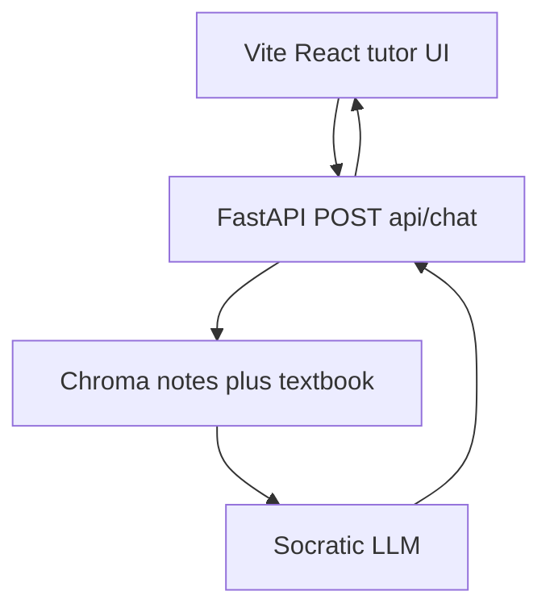
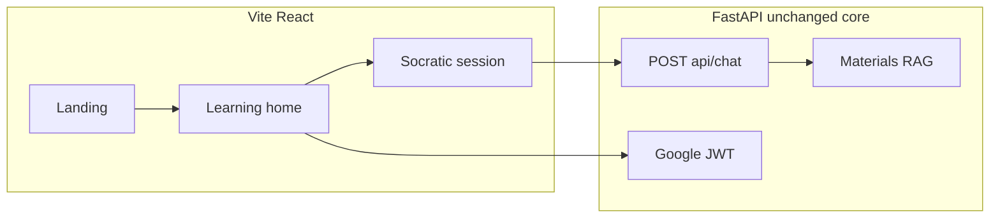

---

This file is the full Schoolhouse / 3D / architecture research report. Day-to-day implementation steps are in [frontend.md](frontend.md).

# Clariq frontend research and implementation plan

**Stack locked for this plan:** Vite + React (current Clariq). Next.js appears in Schoolhouse job ads and in generic 3D stacks; it is **not** the Clariq target. TypeScript can be adopted incrementally later; today the UI is JSX.

**Constraint:** No code in this pass. Keep FastAPI RAG, Socratic prompts, materials/Chroma, Google JWT.

---

## 1. Schoolhouse.world frontend analysis

Public marketing site ([schoolhouse.world](https://schoolhouse.world/)) is a **human peer-tutoring nonprofit**, not an AI chatbot. The “modern educational feel” comes from **trust, people, and programs**, not WebGL.

Observed structure (from the live page):

- **Nav:** About, FAQ, Stories, Get Involved, Donate, Sign in / Sign up. Programs in a mega-menu (SAT, Dialogues, College workshops, Homework help).
- **Hero:** Very large display headline (“Free Online Tutoring. Real Human Connection.”), live social proof (learner counts), two CTAs (Start learning / For parents / For educators).
- **Authority:** Founded by Sal Khan, session counts, quote.
- **Program cards:** Icon-free editorial cards: title, bullets, testimonial, “Learn more”.
- **Social proof:** Long student quotes, tutor “certified” faces in a row/carousel.
- **How it works:** 3–4 numbered steps, Zoom as the session surface.
- **Blog + FAQ accordion + dense footer.**

Design language (public case studies + site copy, not a pixel audit):

- Warm, youthful, **nonprofit-Khan** energy: geometric apple-globe mark, simple cartoon-geometric illustrations, lots of whitespace, big type, round cards, photo/avatar of *people*.
- Brand work (Jackie Liu, 2021–23): Greycliff CF, geometric illustrations, Figma-reusable scenes — [jackieis.online/projects/schoolhouse](https://jackieis.online/projects/schoolhouse/).
- Tutor dashboard case study: card sections, muted illustration, approachable grotesque — [amylima.design/case-study/schoolhouse](https://www.amylima.design/case-study/schoolhouse).
- **No confirmed 3D/WebGL** on the marketing site. The educational “depth” is **layout, type, proof, and human faces**.
- Session UX is **Zoom**, not an in-page tutor. Clariq must invent session UX; copying Schoolhouse’s Zoom model would be wrong.

What Clariq should steal vs not:

- Steal: spacious hero, “how it works” beats, program/subject cards, testimonials of *learning process*, trust/safety copy, mobile-first nav.
- Do not steal: peer-Zoom, SAT bootcamp IA, Framer marketing site as a stack, ChatGPT chrome.

---

## 2. Confirmed vs inferred Schoolhouse tech

**Confirmed (public first-party or official org artifacts):**

- GitHub org [github.com/schoolhouse-world](https://github.com/schoolhouse-world): **Avataaars React** avatar packages; **Zoom API** Node library; k0s fork; gpt-tokenizer. **No public main app repo.**
- Engineering hiring copy (2025-era): TypeScript, Node.js, React, **Next.js**, Postgres, AWS, GCP ([startup.jobs listing](https://startup.jobs/senior-software-engineer-schoolhouse-8298109)).

**Third-party / possibly stale:**

- LeadIQ: Gatsby, Rails, Cloudflare, Varnish, Google Fonts, Font Awesome, Zoom, Zendesk — typical detector mix; **Rails/Gatsby likely historical**.
- AI detector claiming **Framer** for the *marketing* domain (`framerusercontent.com` fingerprints). Treat as **possible for the 2026 marketing site only**, not the logged-in product.

**Not evidenced:** Three.js, R3F, Spline, GSAP as Schoolhouse’s core. Do not assume they use them.

---

## 3. 3D / motion technology investigation

Schoolhouse does **not** prove you need 3D. Use 3D only where it teaches (molecules, orbits, vectors). Clariq already has **GSAP** (`@gsap/react`) and **Framer Motion** unused/lightly used — start there.

- **A Three.js** — raw WebGL. Max control, high complexity. Works with Vite/React via a canvas ref. Docs: [threejs.org](https://threejs.org/docs/).
- **B React Three Fiber** — React renderer for Three. Fits Vite + React. Docs: [r3f.docs.pmnd.rs](https://r3f.docs.pmnd.rs/).
- **C R3F + Drei** — helpers (Stage, useGLTF, Html). Best if you add one real model. [github.com/pmndrs/drei](https://github.com/pmndrs/drei).
- **D GSAP + ScrollTrigger** — page storytelling, already in [frontend/package.json](frontend/package.json). Excellent FYP motion. [gsap.com](https://gsap.com/docs/v3/).
- **E CSS 3D** — `perspective` / `rotateY`. Cheap, accessible, no GPU canvas. Good for cards and “Your turn” depth.
- **F Spline** — visual 3D, `@splinetool/react-spline` on Vite. Fast demos, weak git diffs, extra WebGL, mobile risk. [spline.design](https://spline.design/).
- **G Blender → GLB → R3F** — real science models. Heavy asset pipeline, LOD/compression required. [blender.org](https://www.blender.org/).
- **H Pre-rendered video/Lottie** — fake 3D, tiny GPU, no interaction. Fine for landing loop.

**FYP on a limited laptop:** Prefer D+E now; optional one R3F scene later, **desktop-only**, `prefers-reduced-motion` off-ramp, dynamic `import()`. Spline is a demo trap. Next.js is irrelevant if we stay on Vite.

All of A–G work with TypeScript and Tailwind (canvas sits beside Tailwind layout). Mobile WebGL is the real constraint.

---

## 4. Possible Clariq visual directions (no auto-winner)

**D1 — Clean educational.** Academic indigo/slate (you already have `--accent: #6366f1` in [frontend/src/index.css](frontend/src/index.css)). Outfit + Inter. Quiet nav, textbook-like cards. Tutor looks like a seminar, not Discord. Best for examiners; risk: bland.

**D2 — Friendly AI tutor.** Warmer cream/coral (Schoolhouse-adjacent), rounder type, illustrated beats, avatar. Approachable Grade 10; risk: “kids app” vs FYP seriousness.

**D3 — Modern 3D education.** Dark canvas + one floating molecule/planet. Impressive demo reel; risk: GPU, ChatGPT-with-glassmorphism, delays Socratic UX.

**D4 — Interactive learning space.** Hub as “classroom”: subjects as rooms, session as desk. Strong metaphor; risk: over-IA, confusing vs simple Ask → Think → Reply.

**Tradeoff for Clariq:** D1 structure + D2 warmth on landing, **Socratic chrome in the tutor** (not 3D). D3 only in Phase 8 if time.

---

## 5. Clariq today vs proposed IA

**Today (do not throw away):** `/` landing, `/login` `/signup` `/demo`, `/app` hub, `/app/chat` ChatGPT-like thread ([frontend/src/App.jsx](frontend/src/App.jsx)). Messages are bubbles + `chatgpt-markdown` ([frontend/src/components/chat/Message.jsx](frontend/src/components/chat/Message.jsx)). Hub: topics + materials. Backend: `POST /api/chat` `{question, session_id, socratic_mode}` → `{answer, session_id}` ([backend/app/api/routes.py](backend/app/api/routes.py)). No streaming, no message-role types.

**Proposed routes (evolve, don’t explode):**

- `/` Landing — proof it is Socratic, not ChatGPT.
- `/demo` Keep 5-turn guest.
- `/login` `/signup` Keep Google.
- `/app` Learning home (today’s hub, richer).
- `/app/subjects` Optional: Physics/Chem/Bio/Earth grid (data already in `SUBJECTS`).
- `/app/tutor` Alias or rename of chat — **session**, not “new chat”.
- `/app/progress` Later: local then API.
- Skip separate “Learning session” URL until backend has checkpoints.

Each page: purpose = enter / prove / continue; components = existing layout + new tutor atoms; AI only on tutor/demo; motion = GSAP section reveals; mobile = bottom composer, overlay sidebar (already exists).

---

## 6. Socratic tutor UX (highest priority)

ChatGPT copy/regenerate/thumbs **fights the product**. Replace the visual language:

Student asks → UI shows **one tutor move** tagged as question | hint | (rare) explanation.

Proposed atoms (JSX first):

- `SocraticQuestionCard` — the only full-width AI block ending in `?`
- `HintCard` — collapsible, “tiny hint”, not the answer
- `StudentTurn` — short, right-aligned but labeled “Your reasoning”
- `YourTurnBar` — already a badge; make it a sticky state machine
- `TopicContext` — subject + retrieved source chips (notes vs textbook) when metadata exists
- `LearningCheckpoint` — “You used the word chlorophyll — keep going”
- `MisconceptionFlag` — amber, “Let’s test that idea”
- `ConceptMastered` — only after several good turns (needs backend later)
- `SuggestedProbe` — chips that *continue reasoning*, not “explain photosynthesis”
- `CitationPanel` — optional drawer; never dump PDF

**Together:** a turn is not a bubble soup. Composer placeholder: “Answer the tutor…” after AI asks. Empty state stays topic cards.

Backend later (not now): optional `move_type` on `ChatResponse`. Until then, **heuristic UI** (ends with `?` → question card; settings mode → hint vs explain styling).

---

## 7. Where 3D actually helps

- **Landing:** optional low-poly DNA/atom, CSS 3D or one tiny GLB. Pause on mobile.
- **Physics:** 2D canvas/SVG for vectors often clearer than 3D.
- **Chemistry:** 3D molecules **yes** (ball-and-stick).
- **Biology:** photosynthesis as **2D diagram + Socratic**; cell/DNA 3D optional.
- **Astronomy:** orbits 3D yes.
- **Tutor thread:** **no** WebGL beside text (attention + GPU).

Folder later: `frontend/src/components/3d/` with `ScienceScene.jsx` lazy, `Molecule.jsx`, never imported from `Message.jsx`.

---

## 8. Stack options (Vite + React, not Next)

**A** Vite React Tailwind + Three.js — high control, high cost.

**B** + R3F + Drei + GSAP — best *if* Phase 8 3D happens.

**C** + Spline — fast wow, poor FYP maintainability.

**D (fits repo now)** Vite React Tailwind + **existing Framer Motion + GSAP** + CSS 3D. Lowest risk, matches [frontend/package.json](frontend/package.json).

**Suitability:** D for Phases 1–7 and 9–10. Add B only for Phase 8. Do not introduce Next.js.

---

## 9. Backend integration (frontend contract; no rewrite)

Keep REST `POST /api/chat` for v1 (matches Socratic **wait for student** — not token-spam streaming).

Later, without replacing RAG:

- **SSE** if you stream the *one* Socratic utterance (nice-to-have).
- **WebSocket** not needed for turn-based tutor.
- Progress: localStorage now (`useChatSessions`); later `GET/POST /api/progress` keyed by JWT.
- RAG stays server-side; UI may show `sources: [{kind, title}]` if you add fields later.
- Do not send full notes to the client.

---

## 10. Performance strategy

- No WebGL on `/app/tutor` by default.
- `React.lazy` + `Suspense` for any 3D route.
- GLB Draco/meshopt, textures none or 1k max, one light.
- `prefers-reduced-motion`: skip GSAP/R3F.
- IntersectionObserver: animate in-view only.
- Images: SVG/WebP, no 4K heroes.
- Code-split pages (Vite already).
- Laptop: cap pixel ratio 1.5 in R3F.

---

## 11. Accessibility

- Contrast on light/dark tokens (keep ThemeProvider).
- Focus rings on composer and cards.
- Motion: reduced-motion.
- Don’t rely on color alone for misconception vs mastered.
- Live region for “Your turn”.
- Keyboard: existing Enter-to-send.

---

## 12. Component architecture (evolve current folders)

Keep [frontend/src/components/ui](frontend/src/components/ui). Add:

- `layout/` — Navbar, AppShell (hub + tutor)
- `tutor/` — QuestionCard, HintCard, StudentTurn, YourTurnBar, Composer (move)
- `learning/` — SubjectGrid, TopicCard, MaterialsPanel
- `3d/` — empty until Phase 8

Do not delete ChatPage; restyle internals.

---

## 13. Roadmap (implementation only after approval)

**P1 Foundation** — tokens, type scale, button/card consistency. Risk: theme regressions. Test: light/dark hub+chat.

**P2 Landing** — Schoolhouse-like sections using Ask/Think/Reply; GSAP scroll. Do not copy SAT programs.

**P3 Auth** — visual only; keep Google/JWT.

**P4 Dashboard** — hub as learning home; subjects; continue thread; materials.

**P5 Socratic UI** — replace ChatGPT message chrome. Highest product value.

**P6 Backend contract** — optional `move_type` / sources; still FastAPI. No Qwen swap.

**P7 Progress** — local checkpoints then API.

**P8 3D** — one subject toy, lazy, desktop.

**P9 Polish** — GSAP/Framer micro-interactions.

**P10 Mobile** — composer, hub cards, 3D off.

Testing each phase: browser flows you already use (demo 5 turns, Google materials, chat).

---

## 14. What should and should not change

**Change (frontend):** landing IA, hub as learning space, tutor **not** looking like ChatGPT, motion using libs you already installed.

**Do not:** Next.js rewrite; Python RAG/Socratic/Qwen replacement; Schoolhouse Zoom clone; 3D in every route; deleting `materials` or auth.

---

## 15. Resources

- [threejs.org/docs](https://threejs.org/docs/)
- [r3f.docs.pmnd.rs](https://r3f.docs.pmnd.rs/)
- [pmndrs/drei](https://github.com/pmndrs/drei)
- [gsap.com/docs/v3](https://gsap.com/docs/v3/)
- [spline.design](https://spline.design/)
- [blender.org](https://www.blender.org/)
- [schoolhouse.world](https://schoolhouse.world/)
- [github.com/schoolhouse-world](https://github.com/schoolhouse-world)
- [web.dev/prefers-reduced-motion](https://web.dev/prefers-reduced-motion/)

---

## 16. Proposed architecture

**Proposed default after you approve (not a silent lock-in):** Direction D1+D2, Stack D, Phase 5 before any 3D, stay on Vite React + current backend.
